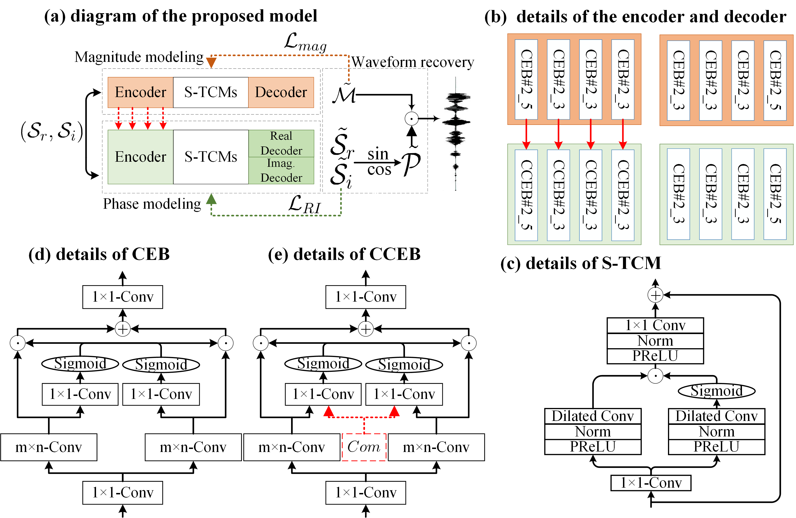

# Foster-Strengths-and-Circumvent-Weaknesses


This repo provides reference implementation and listening samples of **Foster Strengths and Circumvent Weaknesses: a Speech Enhancement Framework with Two-branch Collaborative Learning** as described in the paper:

> Foster Strengths and Circumvent Weaknesses: a Speech Enhancement Framework with Two-branch Collaborative Learning

> Submitted to ICASSP 2022

--------------------
Recent single-channel speech enhancement methods usually convert waveform to the time-frequency domain and use magnitude/complex spectrum as the optimizing target. However, both magnitude-spectrum-based methods and complex-spectrum-based methods have their respective pros and cons. In this paper, we propose a unified two-branch framework to foster strengths and circumvent weaknesses of different paradigms. The proposed framework could take full advantage of the apparent spectral regularity in magnitude spectrogram and break the bottleneck that magnitude-based methods have suffered. Within each branch, we use collaborative expert block and its variants as substitutes for regular convolution layers. Experiments on TIMIT benchmark demonstrate that our method is superior to existing state-of-the-art ones. 

The code will be released recently.

## References
Our paper can be found on Arxiv now:
```bib
@article{tai2021foster,
  title={Foster Strengths and Circumvent Weaknesses: a Speech Enhancement Framework with Two-branch Collaborative Learning},
  author={Tai, Wenxin and Li, Jiajia and Wang, Yixiang and Lan, Tian and Liu, Qiao},
  journal={arXiv preprint arXiv:2110.05713},
  year={2021}
}
```

## Contact

For any questions, please open an issue or drop an email to: `wxtai@std.uestc.edu.cn`
